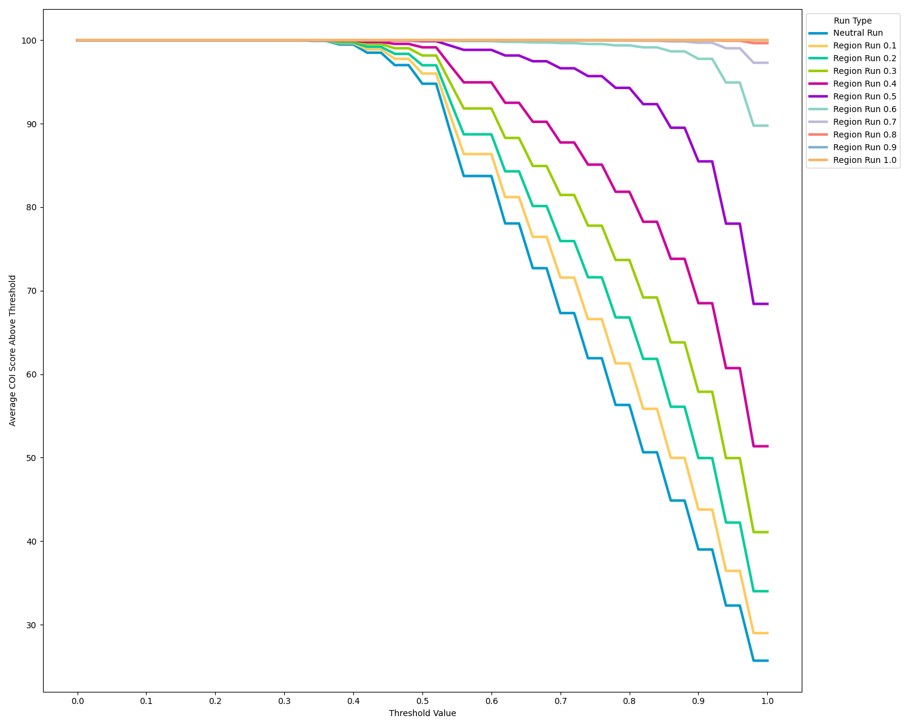
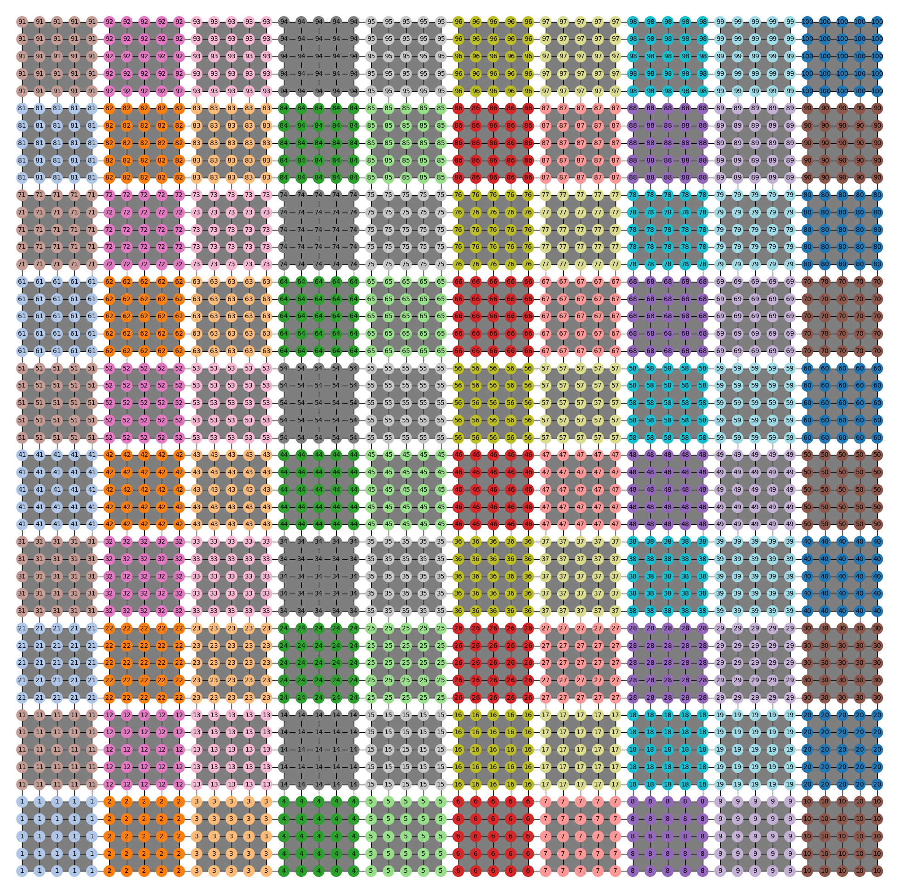
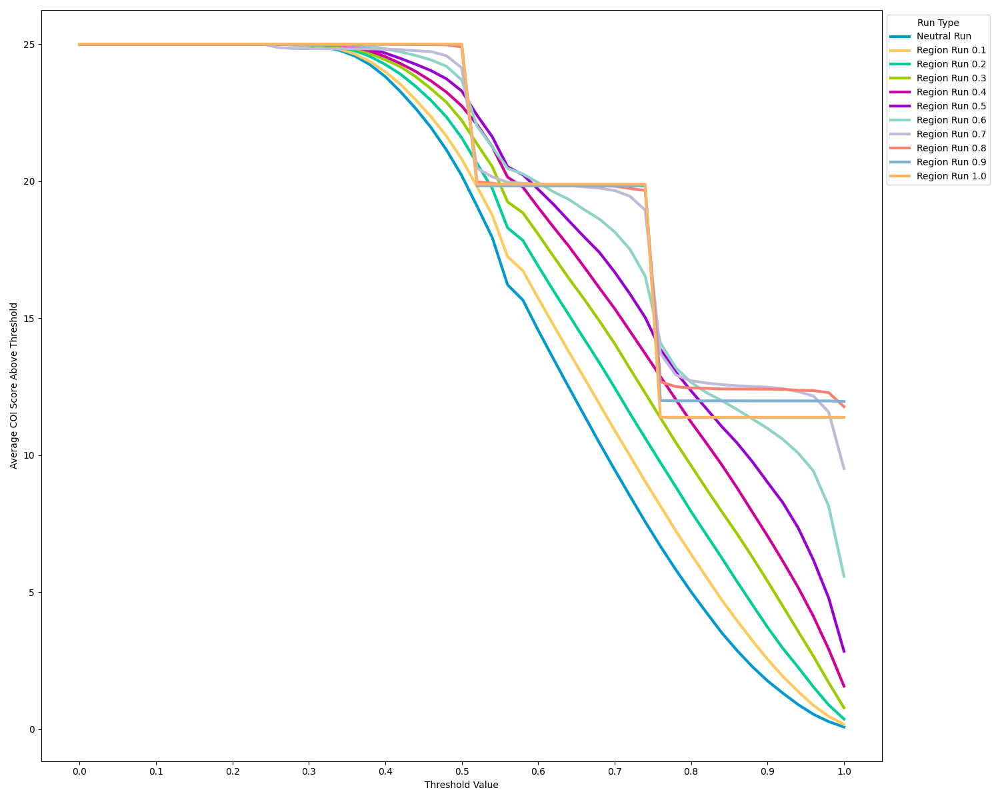
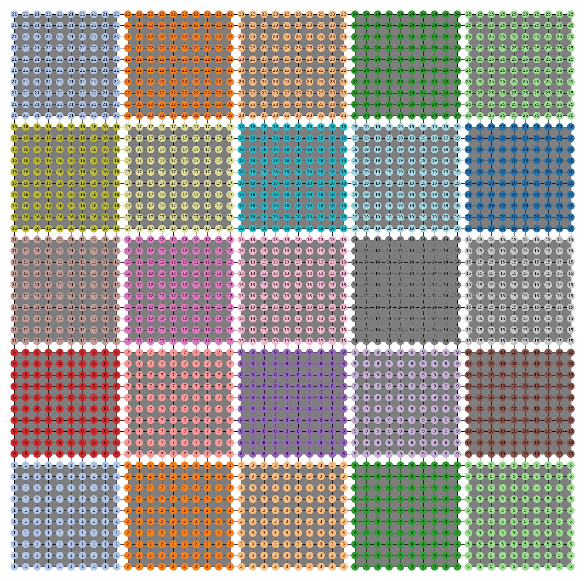
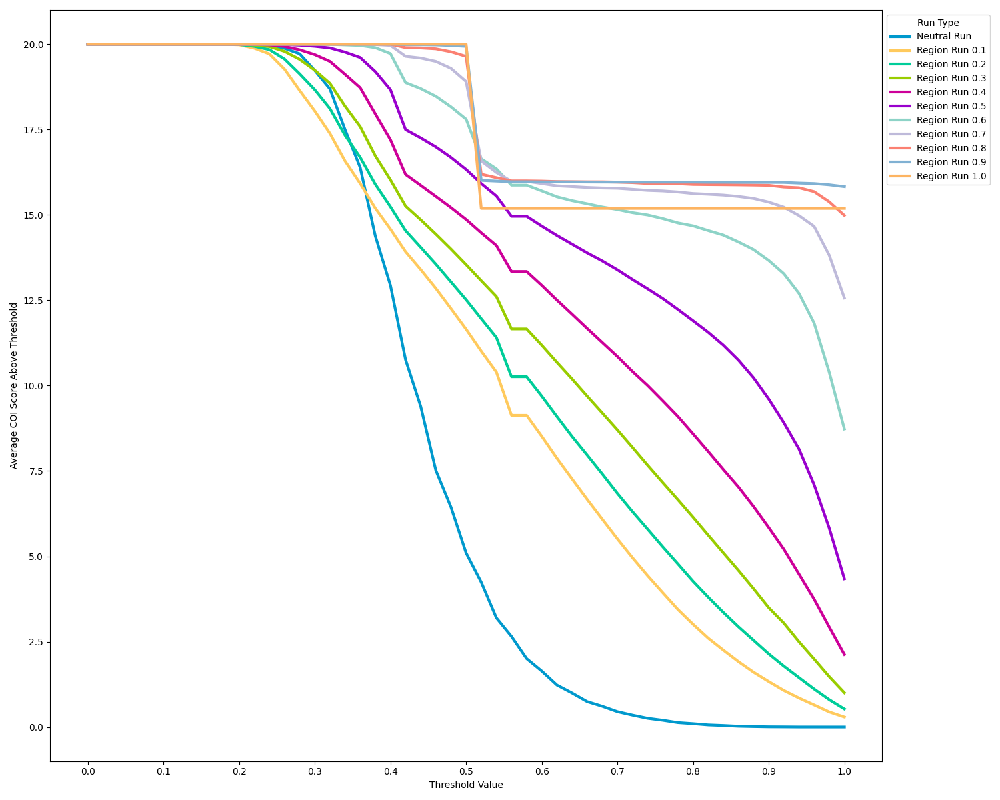
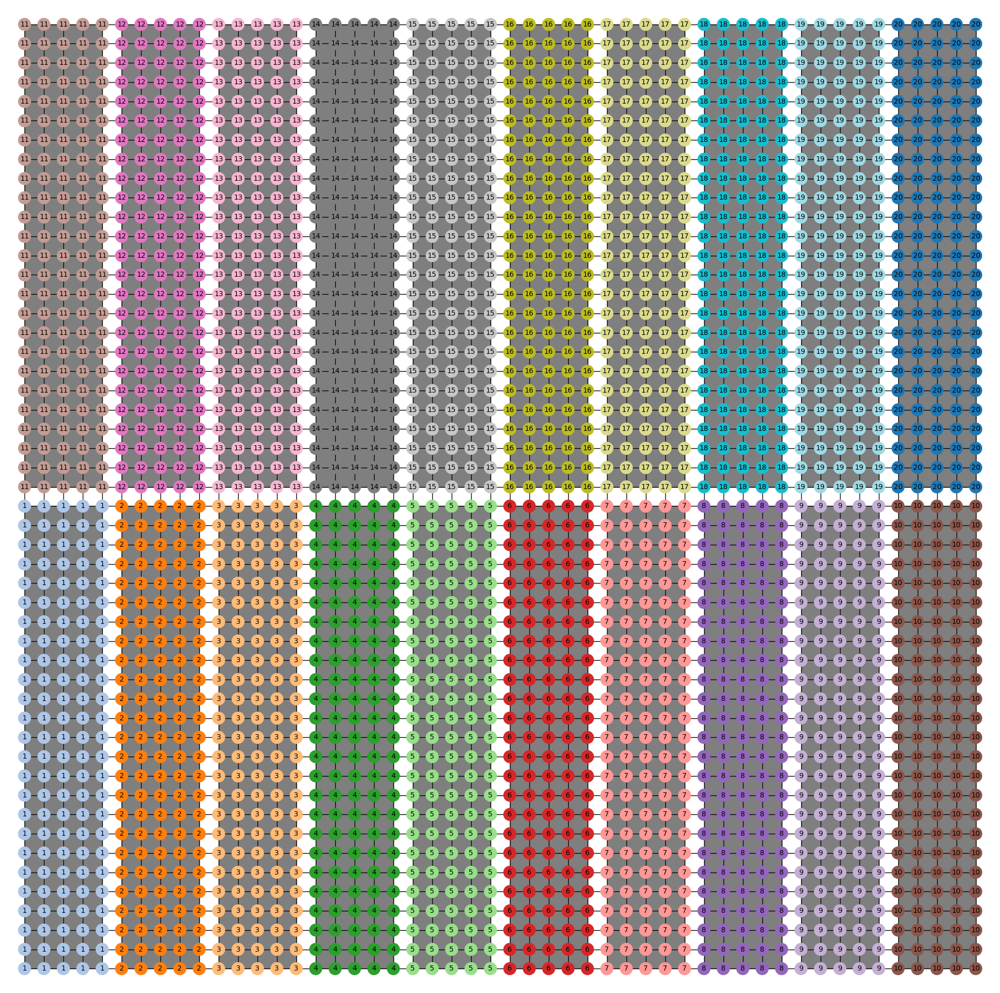
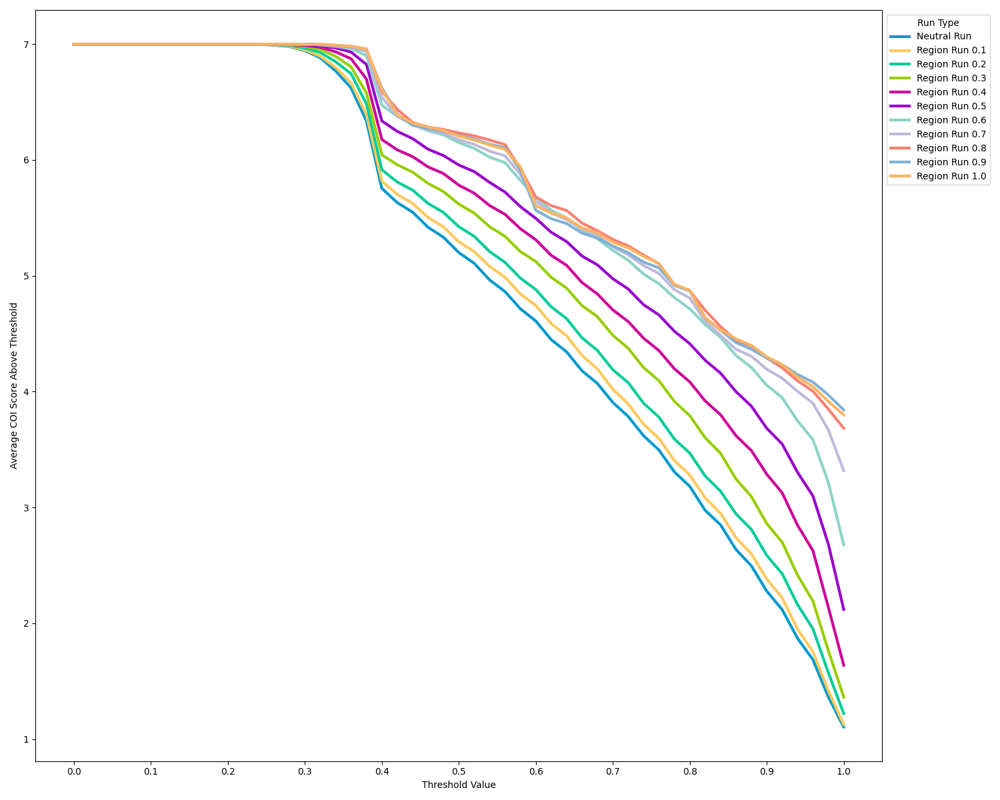
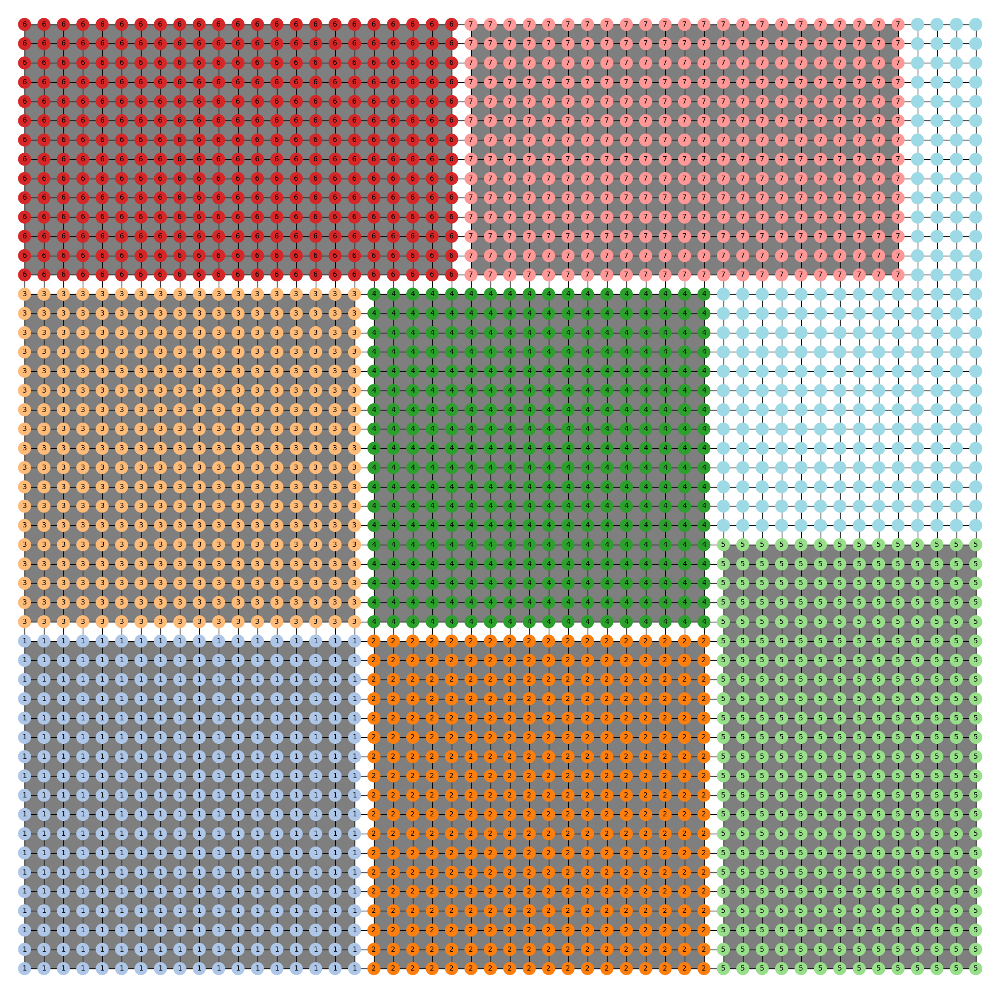

# COI Aggregation

This folder contains all of the necessary files to replicate the following graphs
depicting the efficacy of the region-aware varaint of ReCom with respect to
a custom score.

The score is computed as follows: For a given partitition $P=\{P_j\}_{j=1}^{m}$, inclusion
threshold $t$ and communities of interest $C_1, \dots, C_n$,
we compute the preservation score according to the formula

$$f(P, t) = \sum_{i=1}^n  \max\big[f_1(C_i, P, t),f_2(C_i, P, t)\big]$$ 

with

$$
f_1(C_i, P, t) = \max_{j}\left(\mathbf{1}_{Pop(C_i\cap P_j) \geq t\,Pop(C_i)}\right) 
$$

and

$$
f_2(C_i, P, t) = \sum_{j}\frac{Pop(C_i\cap P_j)\,\mathbf{1}_{Pop(C_i\cap P_j) \geq t\,Pop(P_j)}}{Pop(C_i)} 
$$

where $Pop(C_i)$ is the population of community of interest $C_i$.


## Replication

First the user will need to install the necessary python packages provided in
the `python_packages.txt` file. This as simple as running

```
pip install -r python_packages.txt
```

To replicate these graphs from scratch, you may run the provided python
scripts in the order 
 
1. `run_chains.py`
2. `score_jsonl_files.py`
3. `make_graphs.py`


Note that the first script will take several hours to run. For the convenience
of the reader, the output of `run_chains.py` is provided in the `jsonl_files`
folder in the XBEN format. Any interested reader my run the 
`ben_decompress_files.py` script to get the data in the correct format. For
more information on using this script, see the 
[GerryTools doumentation for BEN](https://gerrytools.readthedocs.io/en/latest/user/ben/).
Any user familiar with cargo and Rust may also run the bash file provided
after installing the `binary-ensemble` package.


> :warning: **Warning:** :warning: The jsonl files provided in the `jsonl_files` will consume 36GB of 
> disk space when decompressed.

For the convenience of the reader, the outputs of the `score_jsonl_files.py`
script are provided in the `csv_files` folder so that the user only needs to run 
`make_graphs.py` to replicate the graphs. This should also make it easier to analyze
the data should the user wish to do so.

## 5x5 COI into 20 districts



## 10x10 COI into 20 districts



## 5x25 COI into 50 districts




## 2p5 COI into 20 districts


